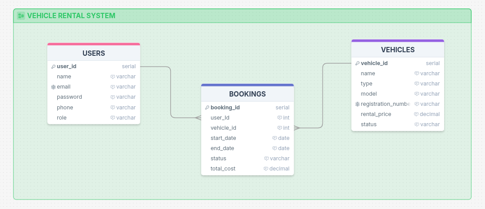

# 🚗 Vehicle Rental System – Database Design & SQL Queries

A relational database project for managing vehicle rentals, focusing on **ERD design**, **database relationships**, and **SQL query implementation** using a simplified Vehicle Rental System.

Built using **PostgreSQL** and **SQL**.

---

## 📌 Project Overview

This project evaluates understanding of:

* Relational database design
* Entity Relationship Diagrams (ERD)
* Primary and Foreign Keys
* Writing SQL queries using JOIN, EXISTS, WHERE, GROUP BY, and HAVING

The system models real-world vehicle rental operations involving users, vehicles, and bookings.

---

## 🎯 Learning Objectives

* Design an ERD with **One-to-One**, **One-to-Many**, and **Many-to-One** relationships
* Apply primary keys and foreign keys correctly
* Write optimized SQL queries to solve business problems

---

## 🗂️ Database Entities

### 👤 Users

* User role (`admin`, `customer`)
* Name, email, password, phone number
* Unique email constraint

### 🚗 Vehicles

* Vehicle name, type (`car`, `bike`, `truck`), model
* Unique registration number
* Rental price per day
* Availability status (`available`, `rented`, `maintenance`)

### 📅 Bookings

* Links user and vehicle
* Rental start and end date
* Booking status (`pending`, `confirmed`, `completed`, `cancelled`)
* Total booking cost

---

## 🧩 ERD Design

The ERD includes the following relationships:

* **One-to-Many:** One user → Many bookings
* **Many-to-One:** Many bookings → One vehicle
* **One-to-One (Logical):** Each booking connects one user and one vehicle

### ERD Includes

* Primary Keys (PK)
* Foreign Keys (FK)
* Relationship cardinality
* Status fields

📌 ERD created using **Drawsql** and submitted as a public shareable link.

🔗 Tool used:
[https://drawsql.app/teams/akash-41/diagrams/vehicle-rental-system]



---

### 🔹 Query 1: Booking Details Using JOIN

**Requirement:**
Retrieve booking information along with customer name and vehicle name.

**Concept Used:** INNER JOIN

```sql
SELECT 
  b.booking_id,
  u.name AS customer_name,
  v.name AS vehicle_name,
  b.start_date,
  b.end_date,
  b.status
FROM bookings b
INNER JOIN users u ON b.user_id = u.user_id
INNER JOIN vehicles v ON b.vehicle_id = v.vehicle_id
ORDER BY b.booking_id;
```

**Explanation:**
This query joins the bookings table with users and vehicles to display complete booking details.

---

### 🔹 Query 2: Vehicles Never Booked

**Requirement:**
Find all vehicles that have never been booked.

**Concept Used:** NOT EXISTS

```sql
SELECT 
    *
FROM vehicles v
WHERE NOT EXISTS (
  SELECT 1 
  FROM bookings b 
  WHERE b.vehicle_id = v.vehicle_id
);
```

**Explanation:**
The NOT EXISTS condition filters vehicles that do not appear in the bookings table.

---

### 🔹 Query 3: Available Vehicles by Type

**Requirement:**
Retrieve all available vehicles of a specific type (e.g., cars).

**Concept Used:** SELECT, WHERE

```sql
SELECT 
  *
FROM vehicles
WHERE type = 'car' AND status = 'available';
```

**Explanation:**
This query filters vehicles by availability status and vehicle type.

---

### 🔹 Query 4: Vehicles With More Than 2 Bookings

**Requirement:**
Find the total number of bookings for each vehicle and display only vehicles with more than two bookings.

**Concept Used:** GROUP BY, HAVING, COUNT

```sql
SELECT 
  v.name AS vehicle_name,
  COUNT(b.booking_id) AS total_bookings
FROM vehicles v
INNER JOIN bookings b ON v.vehicle_id = b.vehicle_id
GROUP BY v.vehicle_id, v.name
HAVING COUNT(b.booking_id) > 2;
```

**Explanation:**
The query groups bookings by vehicle and filters results using HAVING.

---

## 👨‍💻 Author

**Abdul Mazid Akash**

Database & Backend Learner

SQL | ERD | Relational Databases

